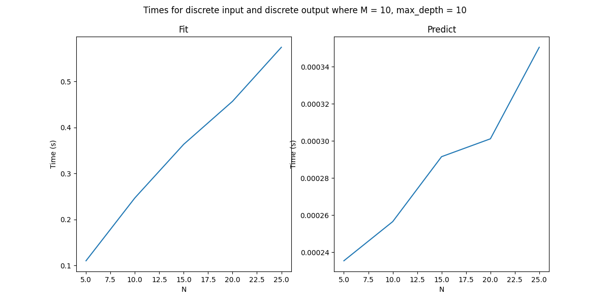
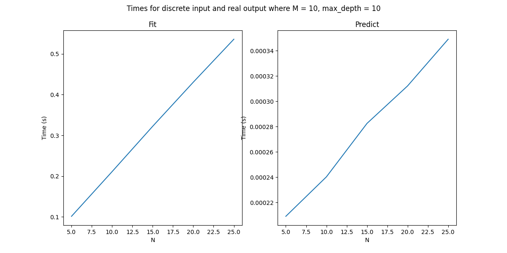
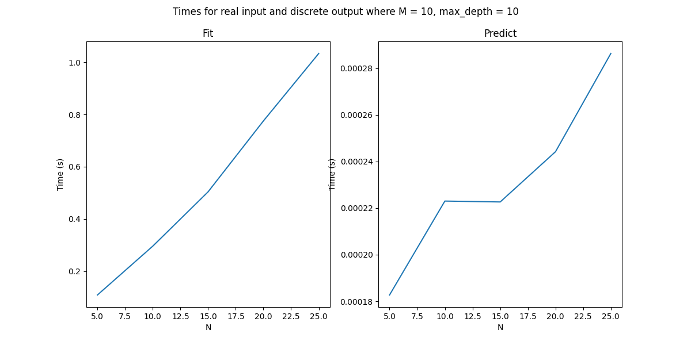
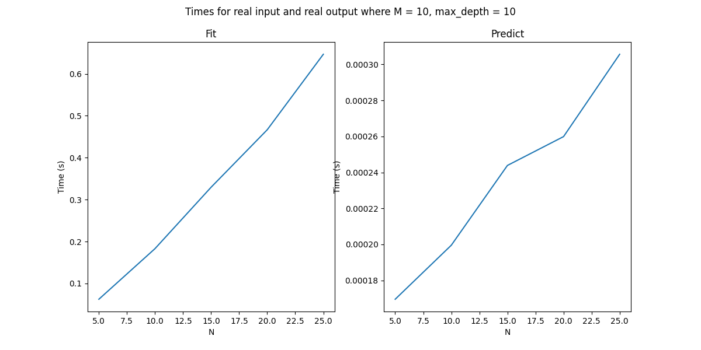
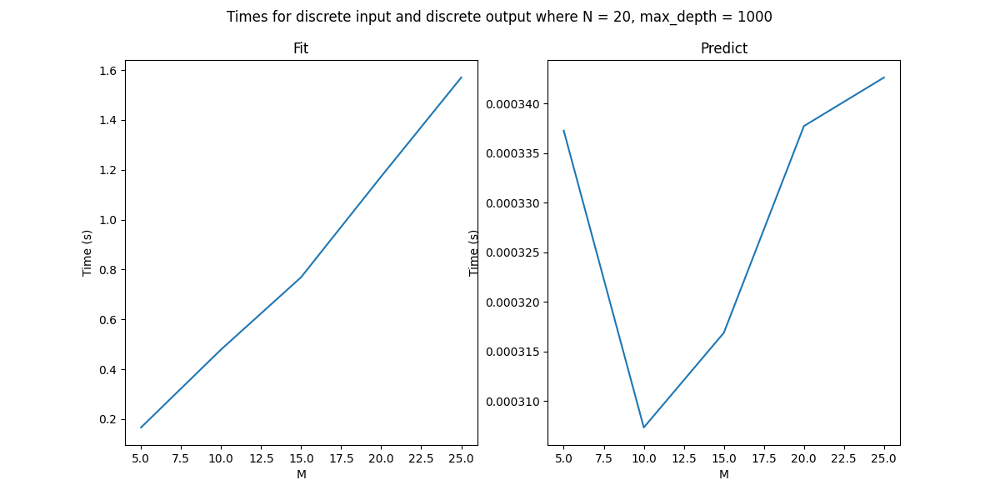
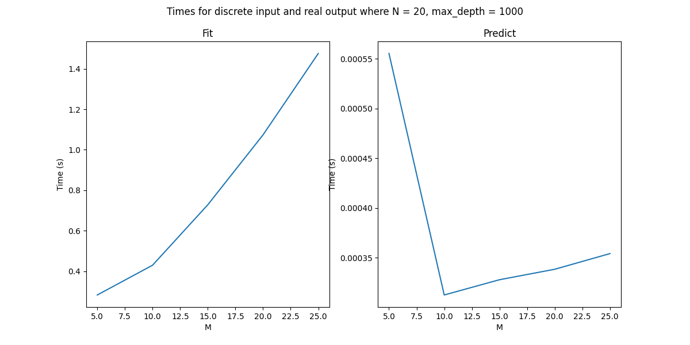
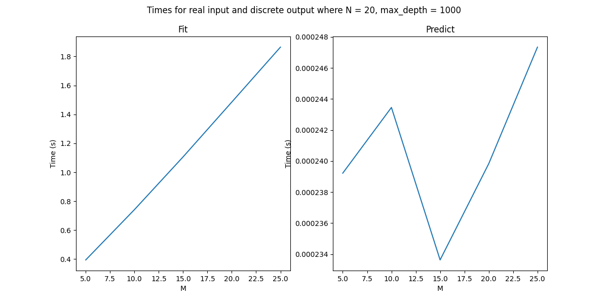
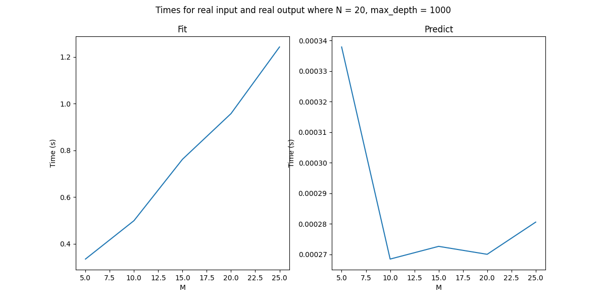

The time complexiy of the fit function is O(N * M * 2^D) where N is the number of samples and D is the depth of the Decision Tree
The time complexity of the predict function is O(N * D) where N is the number of samples and D is the depth of the Decision Tree

This tells us that the graph for N vs time for fit function and predict function should be linear. This also tells us that the plots of M vs Time for fit function should be linear BUT the M vs time for the predict function should be random as M is unrelated to the time complexity of predict fundtion. This is corroborated by the following plots. 

For all four types of inputs and outputs the fit and predict functions are linear with respect to N as shown in the above four plots.  

The fit function is linear with respect to M as shown by the plots. The Time required with respect to M is random as shown by the above four plots.
